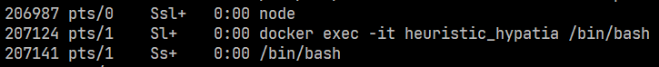
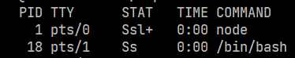

\newpage
# Technologien

Im Laufe der Bachelorarbeit greifen wir auf verschiedene Technologien zu. Einige werden für die Statistikerhebung genutzt, andere bei der späteren Implementierung des Prototyps.

## Docker

Docker^[https://www.docker.com/] ist eine Open-Source-Container-Plattform, mit der der Nutzer Anwendungen isolieren kann.

{ width=1500px }

Um diese Isolierung zu erreichen, werden Funktionalitäten aus dem Linux-Kernel verwendet.
Dazu gehören:

### Kernel Namespaces

Kernel Namespaces isolieren Prozesse, indem sie eine neue virtuelle globale Instanz erstellen und den angegebenen Prozess in diesem ausführen. [@noauthor_namespaces7_nodate]

Somit hat ein Prozess oder mehrere Prozesse einen anderen Blick auf das System als andere Prozesse. [@rosen_resource_2013]

Es gibt 6 verschiedene Arten von Namespaces, die aktuell im Linux Kernel implementiert sind:

#### mnt

Mit dem mnt-Namespace werden Mounts und Unmounts von untergeordneten Namespaces nicht in übergeordneten Namespaces übernommen. Mounts und Unmounts von übergeordneten Namespaces werden aber an alle untergeordneten Namespaces weitergebenen. [@rosen_resource_2013]

#### uts

Mit dem UTS-Namespace kann einem Prozess ein eigener Hostname und Domainname vergeben werden. [@rosen_resource_2013] [@noauthor_uts_namespaces7_nodate]

#### pid

Prozesse in verschiedenen PID-Namespaces können die gleiche Prozess-ID haben. Der erste Prozess in einem neuen PID-Namespace hat immer die PID 1. Die PID von einem Prozess kann von allen übergeordneten Namespaces eingesehen werden aber nicht andersherum. [@rosen_resource_2013]
[@noauthor_pid_namespaces7_nodate]

#### net

In einem Net-Namespace gibt es eine logische Kopie des Netzwerk-Stacks mit eigenen Routing-Tabellen, Firewall-Regeln und Netzwerk-Geräten. Ein Netzwerkgerät kann nur zu genau einem Net-Namespace gehören. Beim Erstellen eines neuen Net-Namespace gibt es nur ein eigenes Loopback-Interface.
[@noauthor_network_namespaces7_nodate]

#### ipc

Durch diesen Namespace müssen Prozesse, die über IPC miteinander kommunizieren möchten, sich im selben IPC-Namespace befinden. [@noauthor_ipc_namespaces7_nodate]

#### user

Mit dem User-Namespace kann jeder Prozess eine eigene Menge an UIDs, GIDs und Berechtigungen haben. Somit kann in einem User-Namespace ein nicht-root-User für diesen Prozess ein root-User sein. [@rosen_rosen-namespaces-cgroups-lxcpdf_2016] [@noauthor_user_namespaces7_nodate]

Durch diese Trennung können Prozesse außerhalb Ihres eigenen Namespaces nicht mit anderen Prozessen kommunizieren.

### cgroups (control groups)

Cgroups ist ein Ressourcen-Management-Subsystem, welches ausgewählten Prozessen nur eine gewisse Menge an Ressourcen, wie CPU-Auslastung, Netzwerk-auslastung und Arbeitsspeicher, zur Verfügung stellt. [@rosen_rosen-namespaces-cgroups-lxcpdf_2016] Hierüber können den Docker Containern, die Ressourcen eingeschränkt werden. 

### chroot

Durch den chroot-Syscall kann das root-Verzeichnis eines Prozesses an einen anderen Pfad gebunden werden und wird auch für alle child-Prozesse genutzt. [@noauthor_chroot2_nodate]

### Images und Container

Durch die Kombinationen von allen oben genannten Funktionalitäten können durch Docker sogenannte isolierte Container erstellt werden. Diese haben ihr eigenes Dateisystem, welches sie durch ein verwendetes Docker-Image erhalten. Ein Image ist ein Abbild eines Dateisystems mit allen benötigten Programmen und Abhängigkeiten, die benötigt werden, um die Anwendung, die das Image beinhaltet, zu betreiben. Des Weiteren können in einem Image weitere Konfigurationen enthalten sein. [@noauthor_docker-documentation_2023]

Ein Container ist somit eine Instanz eines Docker-Images, welche gestartet, gestoppt, verschoben oder gelöscht werden kann. Alle Abhängigkeiten und Programme sind in einem Image gebündelt, wodurch ein Container auf jedem Gerät immer genau gleich funktioniert und keine besonderen Einstellungen am Hostsystem durchgeführt werden müssen.

## InfluxDB und Grafana

Die Daten der Messungen ergebenen eine sogenannte Time-Series. Eine Time-Series ist eine Reihe von Datenpunkten, die anhand ihrer Zeit der Erstellung indiziert wird und einen bestimmten Wert zu genau diesem Zeitpunkt darstellt. InfluxDB ist dabei eine Time-Series Datenbank, die diese Daten effizient speichern und auslesen kann, da zum Teil mehrere Millionen von Datenpunkten pro Sekunde in die Datenbank geschrieben werden können. [@nair_introduction_2021]

Grafana ist eine Open-Source-Lösung für die Darstellung von analytischen Daten auf sogenannten Dashboards. [@shivang_what_2019] In diesem Fall wird es genutzt, um die Time-Series-Daten aus InfluxDB in verschiedenen Graphen darzustellen, die später in der [Evaluierung](#evaluierung) verwendet werden.

## Node und Typescript

Für die Implementation des Skripts zur Messung der Daten und des gesamten Prototyps wird Node^[https://nodejs.org/en/] mit der Programmiersprache Typescript^[https://www.typescriptlang.org/] verwendet. Diese Kombination wurde aufgrund meiner bisherigen Erfahrungen mit diesen Programmiersprachen gewählt.

Node.js benutzt als Runtime die v8-Engine von Google. [@noauthor_documentation-v8_nodate]
Node.js erlaubt es einem Javascript abseits des Browsers auch für Serveranwendungen und alleinstehende Skripte zu benutzten. Dabei benutzt nodejs einen non-blocking Eventloop, durch den man asynchrone Programme schreiben kann. [@nodejs_nodejs_nodate]

Darüber hinaus hat Microsoft 2012 die Programmiersprache Typescript entwickelt, um Javascript typsicher zu machen. Weil Typescript ein Superset von Javascript ist, ist Javascript-Code auch valider Typescript-Code aber nicht umgekehrt. Zudem bringt Typescript einige zusätzliche Features mit, die es in Javascript in dieser Form nicht gibt. Da Webbrowser aber nur Javascript verstehen und keinen eigenen Typescript-Compiler mitliefern, muss Typescript mithilfe des Typescript-Compilers vor der Auslieferung in Javascript transpiliert werden. Hierbei kann auch noch ausgewählt werden, in welche Javascript Version transpiliert werden soll, um großflächig die Kompatibiltät mit älteren Browsern festzustellen, obwohl man selbst beim Programmieren die neuesten Features von Javascript nutzen kann. [@noauthor_why_nodate]

Durch die Typsicherheit werden Bugs, die sonst erst zur Laufzeit auftreten würden, größtenteils bereits zum Zeitpunkt der Kompilierung aufgedeckt und können dann direkt behoben werden.

## Proxmox und VMs

Eine virtuelle Maschine ist ein virtueller Computer, die mithilfe von Software, einem so genannten Hypervisor, auf einem Host-Computer betrieben wird. Hierzu werden virtuelle Komponenten durch den Hypervisor emuliert, wie CPU, RAM, Festplattenspeicher usw. Die Ressourcen dieser Komponenten werden je nach Hypervisor-Typ entweder direkt von der Hardware genommen (Typ 1) oder vom Hostbetriebssystem (Typ 2). [@noauthor_what_nodate-1]

Proxmox ist ein Open-Source-Typ1-Hypervisor, welcher mittels Qemu virtuelle Maschinen bereitstellen kann. Zusätzlich besteht die Möglichkeit LXC-Container direkt über Proxmox zu erstellen und zu verwalten. Qemu nutzt wiederum das im Kernel integrierte KVM-Modul, wodurch die virtuellen Maschinen ihre Ressourcen direkt von der Hardware erhalten können und nichts emuliert werden muss. [@noauthor_proxmox_nodate]

Proxmox und VMs werden im Testaufbau genutzt. Auf diesen wird jeweils Docker installiert und über Docker dann die Gamingserver gehostet.

## Gamingserver

Ein Gamingserver ist eine Anwendung, die auf einem Server läuft und die Zentrale Autorität die den derzeitigen Stand in einem Multiplayer bestimmt. Game-Clients senden über das Internet Pakete mit Informationen über Updates zum Server, wie z.B. "bewegen" und "springen". Der Server verarbeitet diese und sendet bestimmte Informationen zurück an den Client.
[@noauthor_what_nodate-2]

Es gibt verschiedene Arten von Gameservern, die für eine unterschiedliche Anzahl von Spielern und Arten von Games genutzt werden.

### Peer-to-Peer Server

Beim Peer-to-Peer-Server wird ein Client ausgewählt, der das Spiel hosten soll. Bei diesem Client wird der Gameserver im Hintergrund gestartet und alle verbinden sich zu diesem. 

Diese Server sind nur für Spiele mit wenigen Spielern geeignet, da sie ansonsten zu viele Ressourcen vom Computer des Clients benötigen und somit das Spielerlebnis des Spielers beeinträchtigen. Weiterhin müssen bei dem Spiel die Runden unterschiedlich und unabhängig voneinander ablaufen, da jegliche Spieldaten beim Beenden des Servers wieder gelöscht werden. [@noauthor_what_nodate-2]

### Dedicated Servers

Dedizierte Server sind Server, die entweder vom Spielehersteller betrieben werden, zur freien Verfügung auch von zuhause oder über andere Dienstleister gehostet werden können.

Server, die vom Hersteller direkt betrieben werden, sind meist durchgängig eingeschaltet und stehen allen Spielern offen zur Verfügung, um am Mehrspieler-Teil des Spiels teilzunehmen.
[@noauthor_what_nodate-2]

Selbst gehostete Server bieten die Möglichkeit zur freien Konfiguration, Installation von Mods und das Schützen des Zugangs durch ein Passwort, einer White- oder einer Blacklist. Hier kann meist im Client des jeweiligen Spiels entschieden werden, zu welchem Server man sich verbinden möchte. 

In dieser Thesis behandeln wir die dedizierten selbst gehosteten Server, da wir nur diese konfigurieren und analysieren können und demnach auch skalieren können.

Wir schauen uns vier verschiedene Gamingserver an zu den Spielen:

- Conan-Exiles
- Minecraft
- Satisfactory
- Team Fortress 2 (TF2)

Hierbei handelt es sich um vier komplett verschiedene Gamingserver, die unterschiedliche Arten der Konfiguration und des Managements benutzen.

Conan-Exiles und Satisfactory sind in der Unreal-Engine 4 erstellt worden, TF2 in der Source-Engine und Minecraft in einer eigenen Engine, die in Java geschrieben ist.

Inwiefern hier eine Allgemeine Lösung gefunden wird, alle mit einem Programm zu überprüfen, sehen wir im nächsten Abschnitt der [Recherche](#recherche).