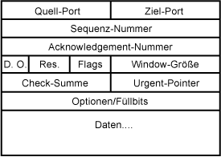
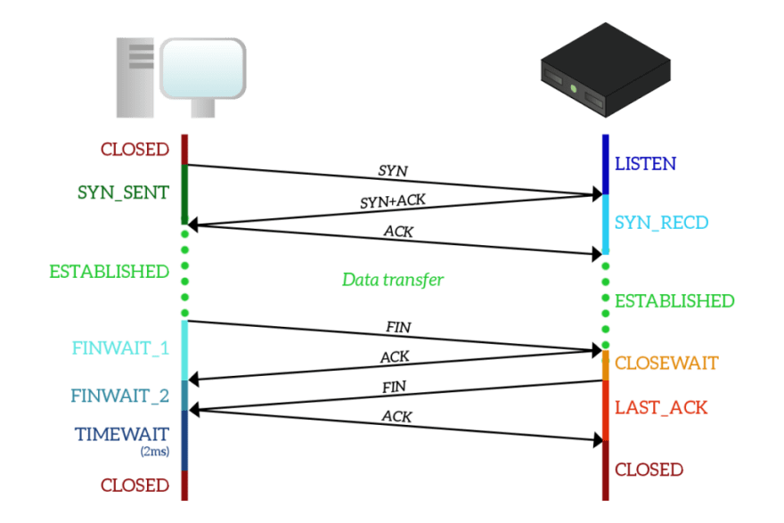
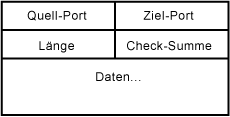
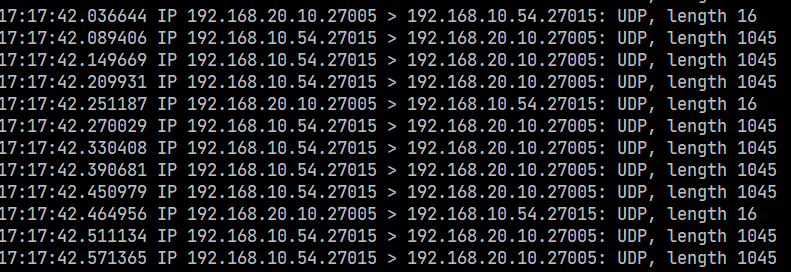
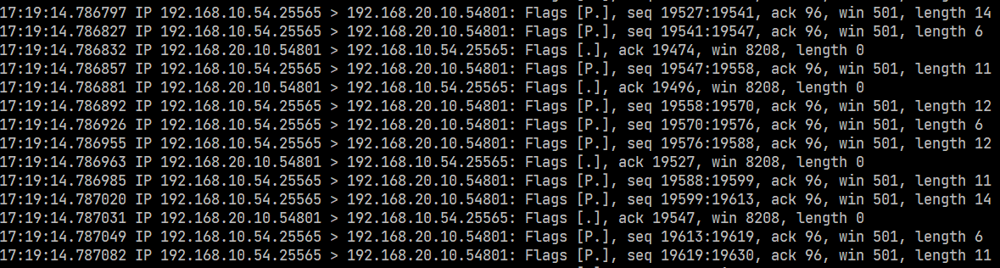
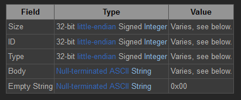
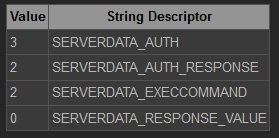
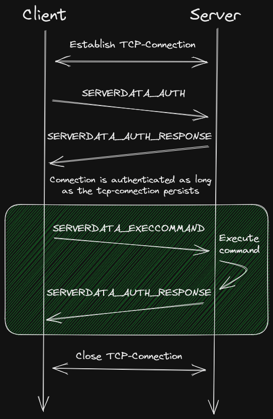

\newpage
# Recherche

## Skalieren

### Definition

Skalieren ist der Prozess zum Anpassen und Erweitern der aktuellen Server-Konfiguration, um effektiver auf eine erhöhte Anzahl von Anfragen und/oder erhöhter Arbeitslast eingehen zu können. [@redswitches_server_2022]

Dabei gibt es zwei Arten von Skalierungen:

#### Vertikale Skalierung

Bei der vertikalen Skalierung, auch up/down scaling genannt, wird der aktuell eingesetzte Server mit besserer Hardware aufgerüstet, um somit die Performance und Effizienz dieses Servers zu verbessern, [@redswitches_server_2022] oder die Hardware wird wieder abgerüstet, wenn der Arbeitsaufwand geringer wird. [@el-rewini_advanced_2005]

#### Horizontale Skalierung

Horizontales Skalieren, auch in/out scaling genannt, bedeutet den Arbeitsaufwand und die Anfragen auf mehrere Server zu verteilen. [@redswitches_server_2022] Wenn die Arbeitslast wieder geringer wird, werden einzelne Server abgeschaltet oder für andere Zwecke genutzt. [@el-rewini_advanced_2005]


### Was heißt bedarfsbedingtes Skalieren?

Bedarfsbedingt besteht aus den Worten "Bedarf" und "bedingt" und bedeutet, dass je nach Bedarf nach oben oder unten skaliert wird. Im Cloud-Computing wird dies unter dem Namen Autoscaling beschrieben. [@kerner_what_2021] 


## Skalieren von dedizierten Gamingservern

Wie lässt sich Skalierung bei Gamingservern darstellen? Die simpelste Art wäre es eine einzige Instanz entweder einzuschalten oder auszuschalten.

Wenn man mehr als nur eine Instanz skalieren möchte, kommt es auf den jeweiligen Gameserver an, ob es Möglichkeiten gibt, mehere Instanzen zu erstellen. Hierbei kommt Minecraft in den Sinn. Es werden Weltdaten im Filesystem der jeweiligen Instanz gespeichert, wodurch es ohne Modifikation des Servers keine Möglichkeit gibt, zwei verschiedene Instanzen auf die gleichen Weltdaten zugreifen zu lassen. [@diaconu_manycraft_2013]

Die gleichen Eigenschaften treffen auch auf Conan-Exiles und Satisfactory zu. Bei beiden Spielen kann die Spielwelt verändert werden, welche auch lokal auf der Festplatte gespeichert wird. 

Bei Team Fortress 2 kann die Spielwelt im Spiel nicht verändert werden und es gibt keinen Zustand, der zwischen zwei Spielen auf dem dedizierten Server gespeichert wird. Somit kann eine weitere Instanz erstellt werden, wenn der Arbeitsaufwand für einen Server zu groß wird. [@noauthor_team_nodate]

### Was ist der Bedarf zum Skalieren?

Der Bedarf wird in dieser Arbeit wie folgt definiert: Wenn ein Spieler auf dem Server spielen möchte, gibt es einen Bedarf, somit soll der Server hochskaliert werden. Wenn keiner mehr auf dem Server spielen möchte, sinkt der Bedarf und der Server soll runterskaliert werden.

Um zu wissen, wann ein Spieler auf dem Server spielen möchte und somit den Server hochzuskalieren, sollte dem Spieler eine Möglichkeit gegeben werden, den Server selbst zu starten.
Dies kann zum Beispiel über eine Webseite oder einen Discord-Bot ermöglicht werden.

#### Wieso ein Discord-Bot? {-}

Discord ist eine Social-Media-Plattform, die in den letzten Jahren immer mehr Benutzer erhalten hat, vor allem im Gamingbereich und Communities. [@chiu_discord_nodate]

Aufgrund dieser Erkenntnis und weil unsere Community auch Discord benutzt, eignet sich ein Discord-Bot als Interface für die Applikation, um den Bedarf der Spieler zu ermitteln, indem sie den Server hierüber starten können.

#### Runterskalieren {-}

Wie wird gemessen, dass kein Spieler mehr spielen möchte? Hierzu sollte der Server nach einer bestimmten Zeit, wenn kein Spieler mehr auf dem Server ist, als inaktiv gewertet werden und daraufhin gestoppt werden. 

Für weitere Instanzen müssen bestimmte Schwellenwerte der Spielerzahlen erreicht werden, damit sich der Bedarf erhöht.

### Spielerzahlen

Der Bedarf richtet sich somit zum großen Teil an die Anzahl der Spieler, die auf dem Server spielen.
In den folgenden Abschnitten werden verschiedene Methoden gezeigt, wie die Anzahl der Spieler auf einem Server ermittelt werden kann.


## Netzwerkaktivität

Eine Möglichkeit die Anzahl der Spieler zu erfahren ist zu ermitteln, wie viele Clients mit dem Server verbunden sind. Hierzu schauen wir uns an, wie Server und Client miteinandern kommunizieren.

### Client-Server Kommunikation

Gameserver und Clients kommunizieren durchgehend miteinander über das Netzwerk, um den aktuellen Zustand des Spiels oder die getroffenen Aktionen zu übermitteln. Hierzu werden entweder die Protokolle UDP oder TCP genutzt.

#### TCP

Das Transmission Control Protocol (TCP) ist eines der Haupt-Protokolle des Internets und wird zusätzlich zum Internet-Protokoll (IP) verwendet, um eine zuverlässige Übertragung von Paketen zu gewährleisten. 

Ein TCP Paket besteht aus vielen Feldern im Header, die alle benötgt werden, um eine zuverlässige Datenübertragung zu gewährleisten ([s. Abb.](#tcp-paket)).

Dazu gehören unter anderem Quell-Port und Ziel-Port, Sequenz- und Bestätigungsnummer und eine Prüfsumme sowie einige Flags die den Fluss der Daten managen. [@gudabayev_tcp_2021]


{ #tcp-paket width=550px }

TCP ist in 3 Phasen unterteilt, die insgesamt eine gesamte Verbindung zwischen Client und Server darstellen. 

##### Verbindungsphase {-}

In der Verbindungsphase sendet der Client ein Paket mit dem Flag SYN. Der Server antwortet auf dieses Paket mit den Flags SYN und ACK. Dann antwortet der Client mit einem ACK-Flag. Sind alle Pakete angekommen, besteht nun eine TCP-Verbindung zwischen Client und Server, über welche nun Daten übertragen werden können. [@gudabayev_tcp_2021]

##### Datentransferphase {-}

In der Datentransferphase können nun Daten ausgetauscht werden. Hierzu können Pakete verschickt werden, die dann vom Empfänger immer mit einem ACK-Paket beantwortet werden müssen. Fehlt diese Antwort, geht der Sender davon aus, dass das Paket verloren oder beschädigt war und sendet es erneut zum Empfänger. [@gudabayev_tcp_2021]

##### Verbindungsabbruchsphase {-}

Möchte der Client oder der Server die Verbindung beenden, wird ein Paket mit dem FIN-Flag verschickt. Dieses wird dann vom jeweiligen Empfänger mit einem FIN-ACK-Paket beantwortet und dann erneut von einem ACK-Paket. Nach erfolgreicher Übermittlung dieser Pakete gilt die Verbindung als geschlossen und müsste bei erneuter Datenabfrage neu hergestellt werden. [@gudabayev_tcp_2021]

{ width=1000px }


#### UDP

Im Gegensatz zu TCP ist das User Datagram Protocol (UDP) ein verbindungsloses Protokoll. Es wird somit keine Verbindung zwischen Client und Server aufgebaut, sondern Pakete werden einfach von a nach b geschickt und gehofft, dass sie ohne Fehler beim Empfänger ankommen. [@gudabayev_udp_2021]

UDP wird auch zusätzlich zum Internet-Protokoll (IP) eingesetzt und ist das zweite Haupt-Protokoll des Internets.

Der Header eines UDP Pakets ist ziemlich simpel und besteht aus dem Quell-Port, Ziel-Port, Länge des Headers und der Daten und einer Prüfsumme ([s. Abb.](#udp-paket)).

{ #udp-paket width=550px }


## Aktive Verbindungen

Um nun aus beiden Protokollen eine Verbindung zwischen Client und Server zu messen, müssen wir wissen wann eine Verbindung besteht.

Bei TCP besteht eine Verbindung, wenn wir in der [Datentransferphase](#datentransferphase) des TCP sind. 

Bei UDP sieht dies anders aus. Da es ein verbindungsloses Protokoll ist, gibt es in UDP kein Konzept der Verbindung und somit keine kontinuierliche Kommunikation zwischen Client und Server. Da aber ein Großteil der Gameserver nur über das UDP Daten vom Client erhalten und an den Client senden, müssen wir hier die Verbindung anders definieren. [@fiedler_client_2016]

Eine Verbindung zwischen Client und Server in UDP besteht, wenn sowohl Client als auch Server in einem gewissen Zeitraum eine gewisse Anzahl an Paketen ausgetauscht haben. Wenn für einige Zeit keine Pakete verschickt werden, gilt die Verbindung als abgebrochen oder beendet. [@fiedler_client_2016]

Doch wie oder an welcher Stelle messen wir aktive Verbindungen?

\newpage
### Router

Alle Pakete ins Internet oder vom Internet weg gehen über den Router. Er ist die zentrale Schnittstelle ins Internet. Und da alle Pakete über diesen Knotenpunkt verlaufen, können wir hier ermitteln, wie viele aktive Verbindungen es zum jeweiligen Gameserver gibt. [@burdova_what_2022]

OPNSense^[https://docs.opnsense.org/manual/diagnostics_firewall.html] und PfSense^[https://docs.netgate.com/pfsense/en/latest/monitoring/status/firewall-states-gui.html] bieten hierfür eine Möglichkeit in den Diagnostics der Firewall an, mit denen man den Status der aktiven Verbindungen betrachten kann. OPNSense bietet hierfür eine API, mit dem man diese Werte auch außerhalb der Weboberfläche erhalten kann. PfSense hat nur mit Hilfe des Packages "pfsense-api"^[https://github.com/jaredhendrickson13/pfsense-api] eine API, mit dem man Zugriff auf die Daten bekommt.

Diese Methode wurde zu Beginn der Thesis genutzt, um erste Spielerzahlen für den Vorher-Nachher-Vergleich zu haben.

### TCP und UDP Forwarder

Wenn kein Router mit einer API vorhanden ist, an dem man die aktiven Verbindungen auslesen kann, müssen die Verbindungen an einer anderen Stelle analysiert werden.

Eine Möglichkeit ist mit Hilfe eines TCP-Forwarders - da ich keine Artikel zu diesem Thema gefunden habe, habe ich ein eigenes "Proof of Concept" erstellt.

In Node.js wurden die Pakete "dgram"^[https://nodejs.org/api/dgram.html] und "net"^[https://nodejs.org/api/net.html] genutzt, um jeweils für die beiden Protokolle UDP und TCP einen Forwarder zu erstellen.

Der Forwarder hört auf einen gewählten Port und wartet auf eingehende Pakete. Wenn eine Verbindung aufgebaut wird, wird ein neuer Socket für diese Verbindung erstellt, der die erhaltenen Daten an den Server weiterleitet. Immer wenn Nachrichten vom Server dann an diesen Socket gesendet werden, werden diese Daten dann zurück zum ursprünglichen Client weitergeleitet.

Bilder des Codes zu diesen Proof of Concept sind im Anhang unter [Anhang 2](#udp-forwarder) und [Anhang 3](#tcp-forwarder) enthalten.

Bei TCP werden beim Beenden der Verbindung vonseiten des Servers oder des Clients die entsprechenden Sockets beendet und aus der Liste der aktiven Verbindungen gelöscht. Somit kann man zu jeder Zeit die beim Erstellen des Servers zurückgegebene Funktion benutzen, um die aktuelle Anzahl der aktiven Verbindungen zu erhalten.

Hier legen wir ein Timeout Wert von 5 Sekunden fest [@fiedler_client_2016]; wenn innerhalb dieser Zeit kein Paket mehr zwischen Client und Server verschickt wird, gilt die Verbindung als beendet und wird aus der Liste der aktiven Verbindungen gelöscht. Auch hier erhalten wir eine Funktion, mit der die aktuelle Anzahl der Verbindungen ermittelt werden kann.

### Server

Ermitteln der aktiven Verbindungen am Server selbst.

Man kann mit verschiedenen Tools die Anzahl der Verbindungen am Server selbst messen,  zum Beispiel mit "tcpdump"^[https://www.tcpdump.org/manpages/tcpdump.1.html].

Mit tcpdump kann man den Netzwerkverkehr des Servers mitschneiden und analysieren; zudem kann man es auf bestimmte Interfaces und bestimmte Ports beschränken, sodass nicht alle Pakete, die dem Server geschickt oder vom Server versendet werden, in dem Ergebnis auftauchen.

Mit dem folgendem Befehl schneidet man zum Beispiel alle Pakete auf dem Interface enp03s auf port 27015 mit.

```bash
sudo tcpdump -n -i enp3s0 port 27015
```

\newpage
Als Ergebnis erhält man dann z.B. diesen Ausschnitt für UDP-Pakete

{ #tcpdump-udp width=1200px }

und diesen Ausschnitt für TCP-Pakete:

{ #tcpdump-tcp width=1200px }

Aus diesen Paketen kann man die einzelnen Verbindungen herauslesen und somit die Anzahl der aktiven Verbindungen erhalten.

## RCON

### Was ist Rcon?

RCON ist ein TCP/IP basiertes Kommunikationsprotokoll, welches es erlaubt mit einer Fernzugriff-Konsole ("Remote Console") Konsolen-Befehle auf dem Server auszuführen.
[@valve_source_rcon_protocol_nodate]

RCON wird inzwischen von mehreren Gameservern unterstützt, um die Server einfacher zu administrieren. Alle Valve Game-Server wie Counter Strike und Team Fortress 2 ^[https://developer.valvesoftware.com/wiki/Source_RCON_Protocol] sowie weitere Spiele von anderen Herstellern wie Minecraft^[https://wiki.vg/RCON] und Conan Exiles^[https://conanexiles.fandom.com/wiki/Rcon] unterstützen dieses Protokoll.

### Struktur der Datenpakete

In der folgenden [Abbildung](#packet-structure) ist die Struktur eines RCON-Pakets abgebildet. Es beinhaltet die Größe des gesamten Pakets, eine ID, die frei vom Client gewählt werden kann und in der Antwort vom Server zurückgeschickt wird, einen Typ, auf den gleich näher eingegangen wird, einen Body, mit dem Inhalt des Pakets, und ein null-Byte am Ende, um das Paket abzuschließen. [@valve_source_rcon_protocol_nodate]

{ #packet-structure }

Es gibt insgesamt vier verschiedene Typen in der RCON-Spezifikation. Wobei SERVERDATA_AUTH_RESPONSE und SERVERDATA_EXECCOMMAND den selben Wert besitzen. Da 
SERVERDATA_AUTH_RESPONSE aber nur in einer Antwort vom Server und SERVERDATA_EXECCOMMAND nur in einer Anfrage vom Client auftaucht, gibt es hier keine Überschneidungsprobleme. [@valve_source_rcon_protocol_nodate]



- SERVERDATA_AUTH:
   In diesem Packet sendet der Client das beim Server eingestellte RCON-Passwort mit, um für den nachfolgenden Nachrichtenverkehr authentifiziert zu sein.

- SERVERDATA_AUTH_RESPONSE:
   Dabei handelt es sich um die Antwort auf das SERVERDATA_AUTH-Paket. Die ID dieses Pakets ist -1, wenn das mitgesendete Passwort falsch ist, und entspricht der ID der Anfrage, wenn es richtig ist. 

- SERVERDATA_EXECCOMMAND:
   Mihilfe dieses Pakets übermittelt der Client seinen auszuführenden Befehl. 

- SERVERDATA_RESPONSE_VALUE:
   Der Server sendet in diesem Packet die Antwort des ausgeführten Befehls. Falls die Nachricht zu lang ist, kann sie in mehreren Packeten an den Client übermittelt werden. [@valve_source_rcon_protocol_nodate]

In der folgenden [Abbildung](#rcon-packet-flow) ist ein üblicher RCON-Paketfluss dargestellt:

{ #rcon-packet-flow width=1000px }

\newpage
### Welche Kommandos gibt es ?

Da RCON uns nur erlaubt Konsolen Befehle auf dem Server auszuführen zu lassen, ist jedem Hersteller selbst überlassen, welche Befehle es gibt. Jedoch haben die meisten Implementierung irgendeinen Befehl, der es erlaubt, eine Liste der aktiven Spieler auf dem Server zu erhalten.

Minecraft hat den Befehl "list", Conan Exiles den Befehl "listplayers" und TF2 den Befehl "users". Der Output dieser Befehle ist auch nicht vereinheitlicht, weshalb diese jeweils anders analysiert werden müssen, um in einem Skript die genaue Anzahl der Spieler zu erhalten.

Das Ergebnis des Befehls "list" in Minecraft leifert folgendes Ergebnis:

```
There are 1 of a max of 20 players online: Akatran
```

Somit benötigen wir nur die erste Zahl im String, welches wir mithilfe von Regex "\\d+" recht einfach erhalten.

Im Falle von TF2 nehmen wir die letzte Zeile und benutzen auch hier Regex, um die erste Zahl zu erhalten.

```
<slot:userid:"name">
0:4:"Akatran"
1 users
```

Bei Conan-Exiles ist es etwas anders, hier zählen wir die Anzahl der Zeilen und ziehen zwei davon ab und erhalten somit dann die Spielerzahl.

```
Idx | Char Name | Player name | User ID | Platform ID | Platform Name
1   | Akatran   | Akatran     | ...     | ...         | Steam
```

Für andere Server gibt es wiederum andere Methoden, die hier aber nicht benannt werden, da sie nicht Teil dieser Thesis sind.

Das RCON-Protokoll wird in der Implementation selbst implementiert und dort werden noch einige Besonderheiten aufgezeigt, die so nicht in der Spezifikation von Valve beschrieben sind.

## Docker für Gamingserver

Es wird Docker für die Instanzen der Gameserver genutzt statt die Anwendung direkt auf dem PC laufen zu lassen. 

Da Docker-Images schon fertig konfigurierte Anwendungen sind, die einfach nur gestartet werden müssen, ist es nicht nötig, die jeweiligen Abhängigkeiten der einzelnen Server zu installieren und zu verwalten. Darüber hinaus kann es aufgrund von verschiedenen Versionen von Abhängigkeiten wie "Wine"  zu Kompatinilitätsproblemen kommen. Weiterhin können bei den Docker-Containern beim Starten und Stoppen zusätzliche Funktionen ausgeführt werden; z.B. wird beim Start der Server aktualisiert und beim Beenden wird die Spielwelt gesichert und dann erst der Server heruntergefahren. [@lamanos_steam-based_2021]