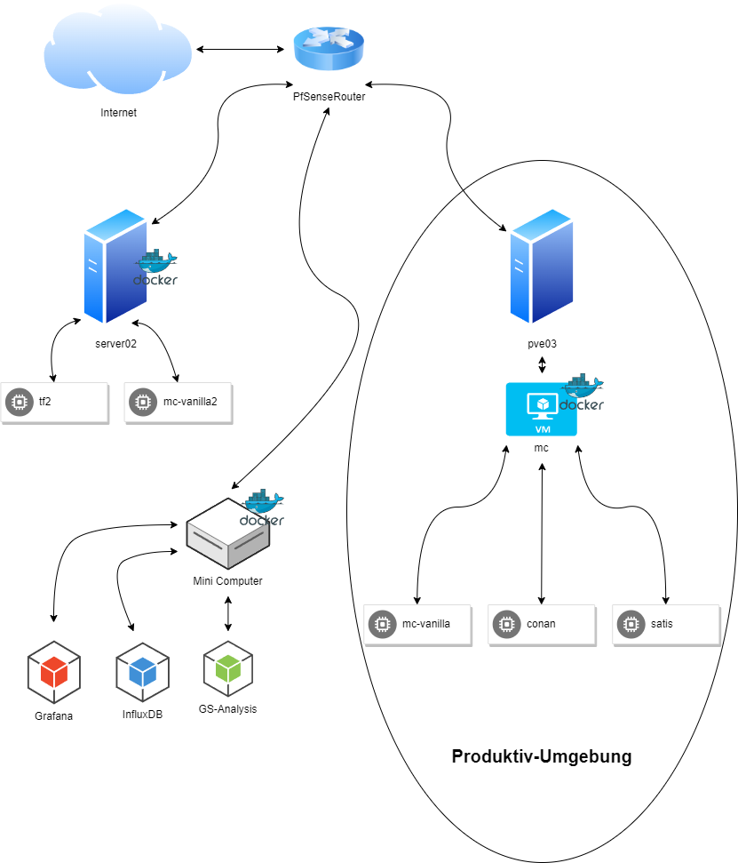

\newpage
# Testaufbau

Die Testumgebung ([Abbildung](#id)) besteht aus zwei Hardware Computern und einem Mini-Computer. Auf einem Hardware Computer wurde Proxmox installiert und eine virtuelle Maschine erstellt. Das Betriebssystem aller PCs und VMs ist Debian 11 und es wurde überall Docker installiert. 

Mithilfe von Docker wurden die verschiedenen Gaming-Server bereitgestellt und auf dem Mini-Computer der in [Abschnitt 7](#implementierung) implementierte Prototyp eingerichtet. 

Alle Geräte befinden sich im selben Subnetz hinter einem PfSense Router. Dieser Router stellt die Gamingserver über Portforwarding dem Internet zur Verfügung.

Die Daten der Messungen werden in der InfluxDB gespeichert und mittels Grafana die Graphen erstellt.

{ height=1500px }
