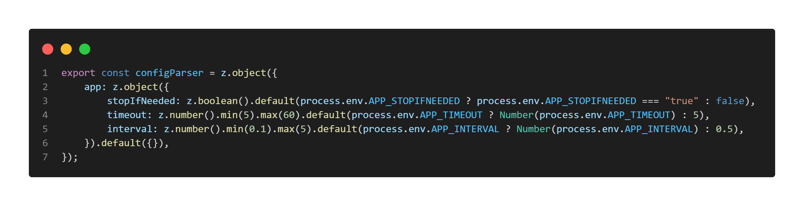
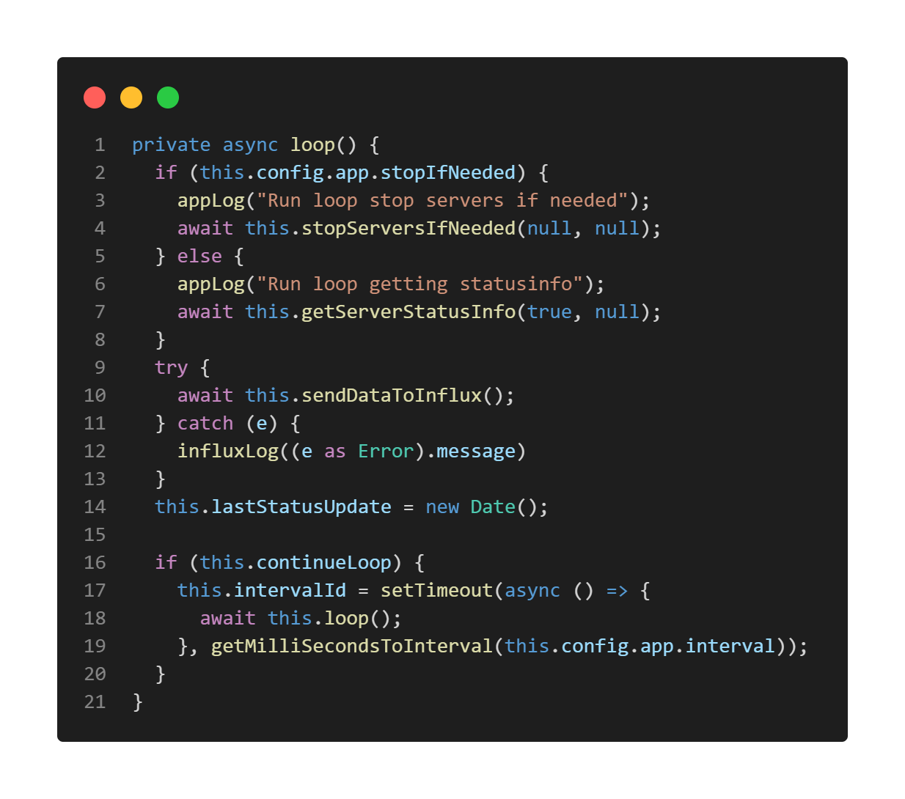
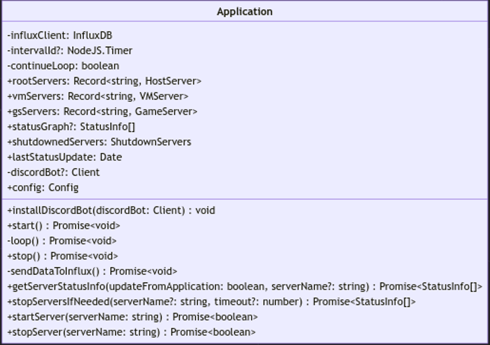
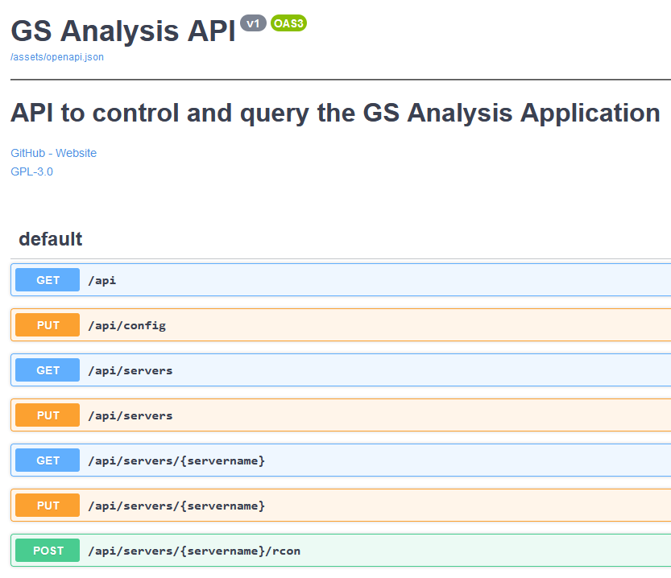
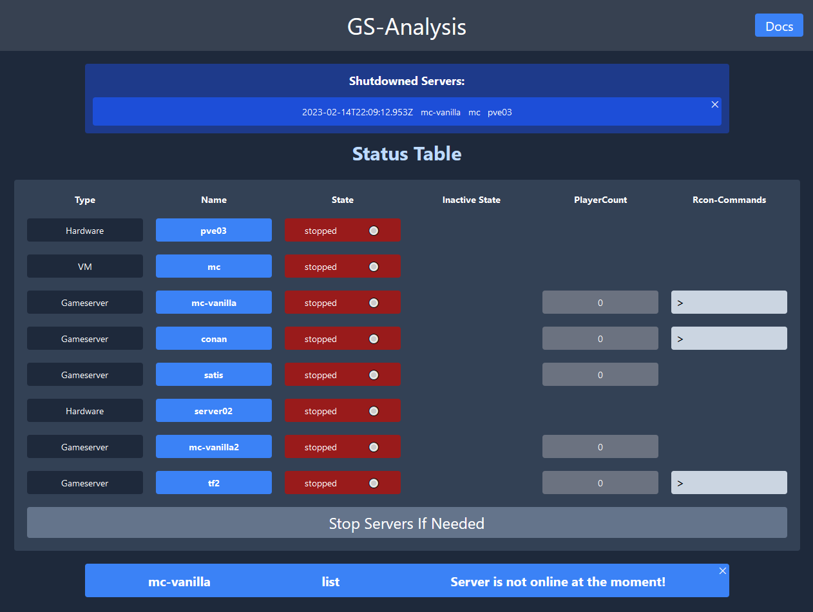
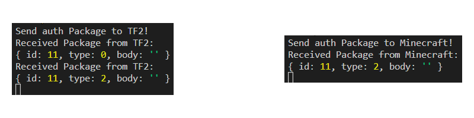
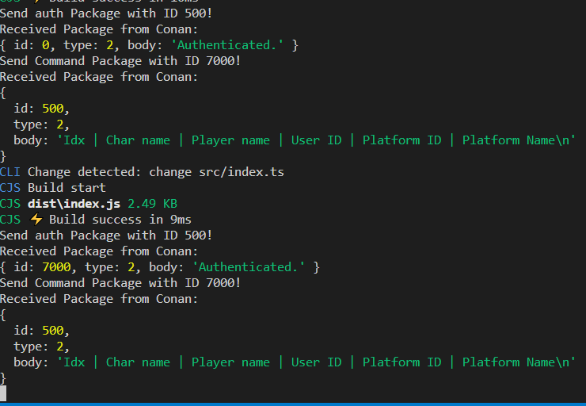

\newpage
# Implementierung

Aus den Punkten der Recherche wird nun ein Prototyp erstellt. Der Prototyp besteht aus mehreren Teilen, die zum Teil miteinander verbunden sind oder getrennt voneinander betrachtet werden können.

## Config Parsing

Mithilfe des Packages zod^[https://www.npmjs.com/package/zod] wird ein Konfigurationsschema definiert. Mit diesem Schema lässt sich ein beliebiges Javascript-Objekt überprüfen, ob es diesem Schema entspricht, und liefert einen Fehler zurück, wenn nicht. Um die Konfiguration auch über Umgebungsvariablen zu ermöglichen, sind diese als Standard-Werte des Schemas angegeben ([s. Abb.](#config-parser)).
{ #config-parser }

Zum Start der Application wird die Konfigurationsdatei von einem Pfad, entweder der Standardpfad "./config.json" oder ein über eine Umgebungsvariable angegebener Pfad, eingelesen. Diese wird dann in ein Javascript-Objekt umgewandelt, mit dem Schema überprüft und dann zurückgegeben.

## Main Application

Der Prototyp liest zu Beginn eine Konfiguration ein und erstellt dann ein Objekt der Klasse Application.

Diese Klasse ist die Main-Application und verwaltet alle Server-Objekte und stellt einige Funktionen zur Verfügung. Mit der Funktion "start" wird der Loop der App gestartet, diese führt je nach Konfiguration entweder "stopIfNeeded" oder "getServerInfoStatus". Beide Funktionen ermitteln den Status der Server und Speichern am Ende den Status in eine Klassenvariable. Der Unterschied ist, dass bei "stopIfNeeded" die für inaktiv gewerteten Server dann sofort heruntergefahren werden. Ein Sequenzdiagramm zu dieser Funktion befindet sich unter [Anhang 9](#sequence-diagram).

Dann wird der aktuelle Status der Server über die Funktion "sendDataToInflux" in InfluxDB gespeichert. Anschließend wird überprüft ob die App weiterlaufen soll und führt den loop im nächsten Interval erneut aus.

Immer wenn Server über die Funktion "shutdownIfNeeded" heruntergefahren werden, wird eine Liste mit diesen Namen abgespeichert.

{ height=1000px }


{ width=800px }

## Discord-Bot

Zusätzlich wurde ein Discord-Bot erstellt, der dem Benutzer über "Slash-Commands" die Funktionen der Main-Application zur Verfügung stellt.

Wenn Server durch die Main-Application heruntergefahren werden, wird ein Event mit der Liste der Server an den Discord-Bot geschickt. Diese wird dann in ein Embed umgewandelt und eine Nachricht in den in der config angegebenen Text-Channel geschickt.

{ width=2000px }


## API

Weiterhin wurde auch eine API hinzugefügt, die auch mit der Main Application interagiert und die gleichen Funktionalitäten wie der Discord Bot bereitstellt. Eine Openapi.json ist in der repo enthalten und eine gerenderte Variante mit SwaggerUI ist im [Anhang 10](#swagger-ui) zu finden.

\newpage



## Webapp

Die Webapp ist das visuelle Interface zur API und zeigt den aktuellen Status der Server an. Weiterhin können über das Betätigen von Buttons die Server gestartet oder gestoppt werden. Für Server bei denen RCON aktiviert ist, können auch RCON-Commands direkt über die Webapp ausgeführt werden. Die Antworten der Kommandos werden dann in einem seperaten Bereich unterhalb der Statustabelle angezeigt.

Unter der Tabelle ist zusätzlich ein Button zum Stoppen der Server, falls sie inaktiv sind. Dies führt die "stopIfNeeded"-Funktion aus jedoch ohne den üblichen in der Konfiguration angegebenen Timeout, sondern sie werden sofort angeschaltet, wenn keine Spieler mehr online sind.

Alle 5 Sekunden wird der aktuelle Status der Server abgefragt. Befindet sich in dieser Antwort eine Liste von Servern die abgeschaltet wurden, werden diese ganz oben in der Webapp angezeigt. 

Die Webapp ist mit React erstellt worden und benutzt "react-query"^[https://tanstack.com/query/latest] mit "axios"^[https://www.npmjs.com/package/axios], um die API-Anfragen zu tätigen und die Antworten zu verarbeiten.

{ width=1500px }


## SSH-Playercount-Client

Dieser Client ist die Prototyp Implementation des Konzeptes aus dem Rechercheteil. 

Mit der "connect"-Funktion wird mithilfe des Pakets "node-ssh"^[https://www.npmjs.com/package/node-ssh] ssh Verbindung zum Host des Gameservers hergestellt. Die Funktion "getPlayerCount" bietet dann die Möglichkeit die Spieleranzahl zu ermitteln. 

Diese Funktion ermittelt die Anzahl der Spieler zwischen zwei Aufrufen dieser Funktion. Somit wird erst das Ende der Funktion beschrieben, um dann auf den Anfang einzugehen.

Es wird auf dem Server der Command tcpdump

```bash
sudo tcpdump -n -i enp03s port 27015 > /tmp/27015
```

ausgeführt, somit wird der Port des Spielsnach Datenpaketen abgehört und alle Pakete in die Datei /tmp/port geschrieben.

Nun zum Start der Funktion. "tcpdump" wird gestoppt und die Datei mithilfe des Befehls "toch" erstellt, wenn sie zuvor nicht vorhanden war. Dann wird die Datei ausgelesen und der Inhalt verarbeitet.

Aus dem Schema von tcpdump ([Abb. 9](#tcpdump-tcp)) werden die IP-Adressen inklusive Ports entnommen und als from und to gespeichert. Dann wird analysiert ob das Paket an den Server oder vom Server geschickt wurde und gezählt welcher Client beteiligt war. Zum Schluss wird diese Liste gefiltert und nur Clients in Betracht gezogen, die mehr als 5 Pakete an den Server geschickt und vom Server bekommen haben. Die Länge dieser Liste ist die Anzahl der Clients, die aktuell auf dem Server sind.


## RCON-Client

Im Bereich dieser Bachelorthesis habe ich einen neuen RCON-Client implementiert.

Hierbei sind einige Probleme bei den verschiedenen Gameservern aufgetreten.

Die Implementation wurde mit dem Package "PromiseSocket"^[https://www.npmjs.com/package/promise-socket] getätigt. Dieses Package wandelt das Eventbasierte-System von der Node-Socket API in eine Promise-Based-API um. Somit werden keine EventListener mehr von außen registertiert, sondern entweder mit "then" oder "await" gearbeitet wie beispielsweise:

```typescript
const response = await promiseSocket.read();
```

Wie bereits im [Abschnitt 5.5.2](#struktur-der-packete) angesprochen müssen Rcon-Commands vor dem Senden authentifiziert werden.

Mit der connect-Funktion des Clients wird nach dem Verbinden mit dem Server sofort eine Nachricht mit dem Passwort hinterhergeschickt. Dann wird auf die Antwort des Servers gewartet und dieses Paket analysiert. Hier gab es bereits Unterschiede in den verschiedenen Server-Implementationen der Gameserver. Der TF2-Server schickt vor der eigentlichen Auth-Response wie in der Spezifikation angegeben ein leeres SERVER_DATA_RESPONSE_VALUE- Package zurück. Minecraft und Conan-Exiles machen dies nicht. 

{ width=1800px }

Somit wird in der Implementation nicht nur das zweite Paket analysiert, sondern es wird auf eine Antwort mit dem Typ 2 (SERVER_AUTH_RESPONSE) gewartet. Wenn die ID -1 zurückgeliefert wird, wird ein Error geworfen. Wenn die mitgeschickte ID zurückgeliefert wird, war die Authentifizierung erfolgreich, das Lesen nach neuen Paketen wird abgebrochen und die connect-Funktion verlassen. Der RCON-Client hat somit den Status connected erlangt.

Weiterhin bietet der RCON-Client die Möglichkeit mit der Funktion "sendCommand" einen Konsolen-Befehl zu senden. Hierzu wird ein Paket mit dem Typ 2 (SERVERDATA_EXECCOMMAND) und dem Befehl im Datensegment an den Server geschickt. Anschließend kommt eine Antwort vom Server mit dem Typ 0 mit der Response des Commands im Body und der gleichen ID wie der mitgeschickten.

In eine Nachricht passen aber nicht mehr als 4096 Bytes, sodass unter Umständen die Antworten in mehreren Paketen verschickt werden, ohne dass das erste Paket Informationen  darüber enthält, wie viele Pakete noch kommen sollen. Da Commands vom Server aber immer nacheinander ausgeführt werden, schlägt die Spezifikation vor zwei SERVERDATA_EXECCOMMAND Pakete zu senden, das erste mit dem tatsächlichen Command und ein zweites ohne Inhalt mit einer anderen ID. Somit ist beim Erhalt einer Antwort mit der ID des zweiten Commands der erste Command abgeschlossen und man kann alle erhaltenen Bodies der Pakete zusammenführen und als Antwort zurückgeben.

Hierbei kam es aber wieder zu Problemen durch unterschiedliche Implementationen des RCON-Servers. Bei Conan Exiles sind die IDs der Antworten immer um eine Anwort verschoben. ([siehe Abbildung 21](#rcon-bug))

Die erste Antwort, sobald der Server gestartet wird, hat immer die ID 0. Somit wurde im Laufe dieser Thesis ein Bug in der Implementation des Servers entdeckt und das Projekt muss auf andere Weise fortgesetzt werden.

\newpage

{ #rcon-bug width=1600px }

Auf Grundlage dieser Entdeckung wurde die Funktion geändert, sodass nur noch die erste Response zurückgegeben und der Rest ignoriert wird, da nicht ermittelt werden kann, wann mehrere Antworten kommen und wann nicht. 

Alternativ gibt es die Funktion "sendCommandWithLongResponse". Diese Funktion wird im Prototypen so nicht genutzt, bietet aber die Möglichkeit nach dem oben genannten Schema mit 2 Command-Anfragen auf eigene Gefahr auf die Antwort der Nachricht mit der zweiten ID zu warten.


## Server Klassen

Die Server Klassen stellen jeweils einen physischen oder virtuellen Server dar und haben Funktionen zum Erhalt des aktuellen Status, zum Stoppen wenn der Server inaktiv ist, zum Stoppen, generell und zum Starten des Servers. Jede Server-Klasse hat ein dazugehöriges zod-Schema, welches die Konfiguration für diesen Servertypen überprüft, weshalb nach erfolgreicher Validierung davon ausgegangen werden kann, dass die nötigen Parameter vorhanden sind.

### Hardware-Server und VM-Server

Ein Hardware-Server hostet entweder eine oder mehrere virtuelle Maschinen und ist deshalb ein ProxmoxHostServer. Somit stehen Funktionen zum Starten und Stoppen von VMs zur Verfügung und der Server selbst kann auch über die API von Proxmox beendet werden anstatt über ssh.

Ein Hardware-Server kann, genau wie ein VM-Server, auch direkt einen Gameserver hosten. In diesem Fall haben beide eine Dockerhost-Instanz, die die Dockerverbindung verwaltet und wodurch dann die Gameserver gestartet und gestoppt werden können.

### Gameserver

Es gibt zwei verschiedene Arten von Gameserver: CommonGameServer und RconGameServer. Diese unterscheiden sich in dem Punkt wie sie die Spieleranzahl ermitteln. Der CommonGameServer benutzt hierzu den SSH-PlayerCount-Client und der RconGameServer den RconClient.

Gestartet und gestoppt werden sie durch einen Dockerhost sowie überwacht, ob der Server aktuell "stopped" ist oder "running" ist.

\newpage
## Magic-Packet

Ein Problem bestand zu diesem Zeitpunkt noch. Die Gameserver konnten zwar über Docker gestartet werden, aber wie wird der Hostserver gestartet? Hierbei verwenden wir das sogennante "Magic-Packet". Dabei handelt es sich um ein UDP-Datenpaket welches über Broadcast an alle Geräte im Subnetz verschickt wird und die MAC-Adresse des zu startenden PCs beinhaltet. Ist die Netzwerkkarte Magic-Packet fähig und sind die benötigten Einstellungen im BIOS und im Betriebssystem getroffen worden, startet der PC beim Erhalt eines solchen Pakets automatisch. 

In der folgenden Abbildung finden wir den Source-Code zum Versenden dieses Magic-Packets.

```Typescript
private async sendMagicPacket() {
        const { mac, ipAdress } = this.info
        const packet = Buffer.from(
	        "ff".repeat(6) + mac.replaceAll(mac[2], "").repeat(16)
		    , "hex"
		);

        const socket = DgramAsPromised.createSocket("udp4");
        const broadcast = 
	        `${ipAdress.substring(0, ipAdress.lastIndexOf("."))}.255`;

        await socket.bind();
        socket.setBroadcast(true);

        for (let i = 3; i > 0; i--) {
            await socket.send(packet, 9, broadcast);
        }
        await socket.close();
    }
```
