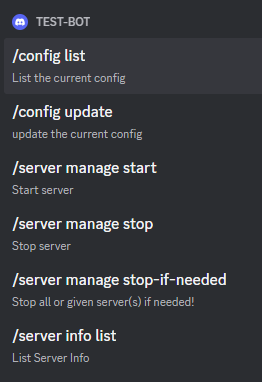
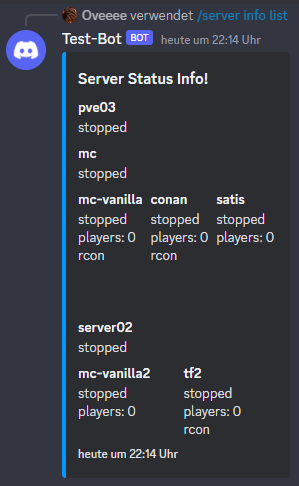
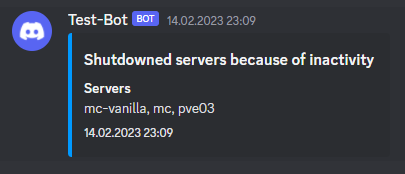
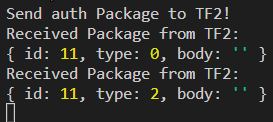
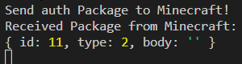

\newpage
# Implementierung

Aus der Punkten der Recherche und dem entgangenen Konzept wird nun ein Prototyp erstellt.

    Das Projekt wurde als Monorepo mithilfe von Turborepo angelegt, somit wurde das Projekt    in einzelne Packages und Apps unterteilt.

Der Prototyp besteht aus mehreren Teilen, die zum Teil miteinander verbunden sind oder getrennt voneinander betrachtet werden können.

## Config Parsing

Mithilfe des Packages zod ^[https://www.npmjs.com/package/zod] wird ein Konfigurationsschema definiert. Mit diesem Schema lässt sich ein beliebiges Javascript Objekt überprüfen ob es diesem Schema entspricht und liefert einen Fehler zurück wenn nicht. Um die Konfiguration auch über Umgebungsvariablen zu ermöglichen, sind diese als Standard-Werte des Schemas angegeben (siehe [Abb. 3](#config-parser)).

{ #config-parser }

Zum Start der Application wird die Konfigurationsdatei von einem Pfad, entweder der Standardpfad "./config.json" oder über eine Umgebungsvariable angegebener Pfad, eingelesen. Diese wird dann in ein Javascript-Object umgewandelt und mit dem Schema überprüft und dann zurückgegeben.

## Main Application

Der Prototyp liest zu beginn eine Konfiguration ein und erstellt dann ein Object der Klasse Application.

Diese Klasse ist die Main Application und verwaltet alle Server-Objekte und stellt veröffentlicht einige Funktionen. Mit der Funktion start wird der Loop der App gestartet, diese führt je nach Konfiguration entweder "stopIfNeeded" oder "getServerInfoStatus". Beide Funktionen ermitteln den Status der Server und Speichern am Ende den Status in eine Klassenvariable. Der Unterschied ist das bei stopServerIfNeeded die für inaktiv gewerteten Server dann sofort heruntergefahren werden. Ein Sequenzdiagram zu dieser Funktion befindet sich unter [Anhang 9](#sequence-diagram).

Dann wird der aktuelle Status der Server über die Funktion "sendDataToInflux" in InfluxDB gespeichert. Dann wird überprüft ob die App weiterlaufen soll und führt den loop im nächsten Interval erneut aus.

Immer wenn Server über die Funktion shutdownIfNeeded heruntergefahren werden, wird eine Liste mit diesen Namen abgespeichert.


## Discord Bot

Zusätzlich wurde ein Discord Bot erstellt der mit der Main Application interagiert und mithilfe von SlashCommands.

Wenn Server durch die Main-Application heruntergefahren werden wird ein Event an den Discord-Bot geschickt mit der Liste der Server. Diese wird dann in ein Embed umgewandelt und eine Nachricht in den in der config angegebenen Text-Channel geschickt.

{ height=2in }

{ height=2in }

{ height=2in }


## API

Weiterhin wurde auch eine API hinzugefügt die auch mit der Main Application interagiert und die gleichen Funktionalitäten wie der Discord Bot bereitstellt. Eine Openapi.json ist in der repo enthalten und eine gerenderte Variante mit SwaggerUI ist im [Anhang 10](#swagger-ui) zu finden.


## Webapp

Die Webapp ist das visuell Interface zur API und zeigt den aktuellen Status der Server an. Weiterhin können über das Betätigen von Buttons die Server gestartet oder gestoppt werden. Bei Servern bei denen Rcon aktiviert ist können auch RCON-Commands direkt über die Webapp ausgeführt werden. Die Antworten der Kommandos wird dann in einem seperaten Bereich unterhalb der Statustabelle angezeigt.

Unter der Tabelle ist zusätzlich ein Button zum Stoppen der Server falls sie inaktiv sind. Dies führt die stopIfNeeded Funktion aus jedoch ohne den üblichen in der Konfiguration angegebenen Timeouts, sondern sie werden sofort angeschaltet wenn keine Spieler mehr online sind.

Alle 5 Sekunden wird der aktuelle Status der Server abgefragt, befindet sich in diser Antwort eine Liste von Servern die abgeschaltet wurden, werden diese ganz oben in der Webapp angezeigt 

Die Webapp ist mit React erstellt worden und benutzt React-Query mit axios um die API-Anfragen zu tätigen und die Antworten zu verarbeiten.


## SSH-Playercount-Client

Dieser Client ist die Prototyp Implementation des Konzeptes aus dem Recherchen Teil. 

Mit der connect-Funktion wird mit dem Paket node-ssh eine ssh Verbindung zum Host des Gameservers hergestellt. Die Funktion getPlayerCount bietet dann die Möglichkeit die Spieleranzahl zu ermitteln. 

Diese Funktion ermittelt die Anzahl der Spieler zwischen zwei aufrufen dieser Funktion. Somit wird erst das Ende der Funktion beschrieben um dann auf den Anfang einzugehen.

Es wird auf dem Server der Command tcpdump

```bash
sudo tcpdump -n -i enp03s port 27015 > /tmp/27015
```

somit wird der Port des games abgehört nach packages und alle Pakete in die Datei /tmp/port geschrieben.

Nun zum start der Funktion. tcpdump wird gestoppt und die datei getoucht damit sie auf jeden Fall existiert. Dann wird die Datei ausgelesen und der Inhalt verarbeitet.

Aus dem Schema von tcpdump [Abb. 12](#tcpdump-tcp) werden die IP-Adressen inklusive Ports entnommen und als from und to gespeichert. Dann wird analysiert ob das Paket an den Server oder vom Server geschickt wurde und gezählt welcher Client beteiligt war. Zum Schluss wird diese Liste gefiltert und nur clients in betracht gezogen die mehr als 5 Pakete an den Server geschickt und 5 Pakete vom Server bekommen haben. Die Länge dieser Liste ist die Anzahl der Clients die aktuell auf dem Server sind.

## RCON-Client


Im Bereich dieser Bachelorthesis habe ich einen neuen Rcon-Client implementiert.

Hierbei sind einige Probleme bei den verschiedenen Gameservern aufgetaucht.

Es wurd eine erste Implementation mit dem Package "PromiseSocket"([]) versucht. Dieses Package wandelt das Eventdriven-system von der Node-Socket API in eine Promise-Based-API um. Somit werden keine EventListener mehr von außen registertiert, sondern entweder mit then oder await gearbeitet wie besispielsweise:

```typescript
const response = await promiseSocket.read();
```

Wie bereits im Abschnitt ... angesprochen muss man bevor man Rcon-Commands senden kann authentifizieren.

Mit der connect Funktion des Clients wird nach dem Connecten mit dem Server sofort eine Nachricht mit dem Passwort hinterhergeschickt. Dann wird auf die Antwort des Servers gewartet und diese Paket analysiert. Hier gab es bereits unterschiede in den verschiedenen Server-Implementationen der Gameserver. Der TF2-Server schickt vor der eigentlichen Auth-Response wie in der Spezifikation angegeben ein leeres SERVER_DATA_RESPONSE_VALUE Package zurück. Minecraft und Conan-Exiles machen dieses nicht. 





Somit wird in der Implementation nicht nur das zweite Paket analysiert, sondern es wird auf eine Antwort mit dem Typ 2 (SERVER_AUTH_RESPONSE) gewartet. Wenn die ID -1 zurückgeliefert wird, wird ein Error geworfen. Wenn die die mitgeschickte ID zurückgeliefert wird war die Authentifizierung erfolgreich und das lesen nach neuen Paketen wird abgebrochen und die connect Funktion verlassen. Der Rcon-Client hat somit den Status connected erlangt.


Weiterhin beitet der Rcon-Client die Möglichkeit einen Command zu senden mit der Funktion sendCommand. Herzu wird ein Paket mit dem Typ 2 (SERVERDATA_EXECCOMMAND) und dem Command im Body an den Server geschickt. Anschließend kommt eine Antwort vom Server mit dem Typ 0 mit der Response des Commands im Body und der gleichen ID wie der mitgeschickten.

Da in eine Nachricht aber nicht mehr als 4096 Bytes passen werden unter umständen die Antworten in mehreren Paketen verschickt, da man am ersten Paket aber keine Informationen erhält wie viele Pakete noch kommen sollen. Da commands vom Server aber immer nacheinander ausgeführt werden schälgt die Spezifikation vor zwei SERVERDATA_EXECCOMMAND Pakete zu senden, das erste mit dem tatsächlichen command und ein zweites ohne Inhalt mit einer anderen ID. Somit ist beim Erhalt einer Antwort mit der ID des zweiten Commands der erste Command abgeschlossen und man kann alle erhaltenen Bodies der Pakete zusammenführen und als Antwort zurückgeben.

Hierbei kam es aber wieder zu Problemenen durch unterschiedliche Implementationen des Rcon-Servers. Bei Conan Exiles sind die IDs der Antworten immer um eine Anwort verschoben.

Die erste Antwort sobald der Server gestartet wird hat immer die ID 0. Somit wurde im Laufe dieser Thesis ein Bug in der Implementation des Servers entdeckt und es muss anders gearbeitet werden.


Auf Grundlage dieser Entdeckung wurde die Funktion geändert, dass nur noch die erste Response zurückgegeben wird und der Rest ignoriert wird. Da nicht ermittelt werden kann wenn mehrere Antworten kommen und wann nicht. 

Alternativ gibt es dann noch die Funktion sendCommandWithLongResponse. Diese Funktion wird inm Prototypen so nicht genutzt, bieter aber die Möglichkeit nach dem oben genannten Schema mit 2 Command-Anfragen auf eigene Gefahr auf die Antwort der Nachricht mit der zweiten ID zu warten.


## Server Klassen

Die Server Klassem stellen jeweils einen physischen oder virtuellen Server dar und hat Funktionen zum Erhalt des aktuellen Status, zum Stoppen wenn der Server inaktiv ist, zum Stoppen generell und zum Starten des Servers. Jede Server-Klasse hat ein dazugehöriges zod-Schema welches die Konfiguration für diesen Servertypen überprüft, weshalb nach erfolgreicher Validation davon ausgegangen werden kann, das die nötigen Parameter vorhanden sind.

### HardwareServer und VMServer

Ein Hardware-Server hostet entweder eine oder mehrere virtuelle Maschinen und ist deshalb ein ProxmoxHostServer, somit stehen Funktionen zum starten und stoppen von VMs zur Verfügung und der Server selbst kann auch über die API von Proxmox beendet werden anstatt über ssh.

Oder ein HardwareServer hostet Gameserver direkt genau wie ein VM-Server. In diesem Fall haben beide eine Dockerhost-Instanz, die die Dockerverbindung verwaltet und wodurch dann die Gameserver gestartet und gestoppt werden können.

### Gameserver

Es gibt zwei verschiedene Arten von Gameserver: CommonGameServer und RconGameServer. Diese unterscheiden sich in dem Punkt wie sie die Spieleranzahl ermitteln. Der CommonGameServer benutzt hierzu den SSH-PlayerCount-Client und der RconGameServer den RconClient.

Gestartet und gestoppt werden sie durch einen Dockerhost sowie ob der Server aktuell gestoppt ist oder running ist.