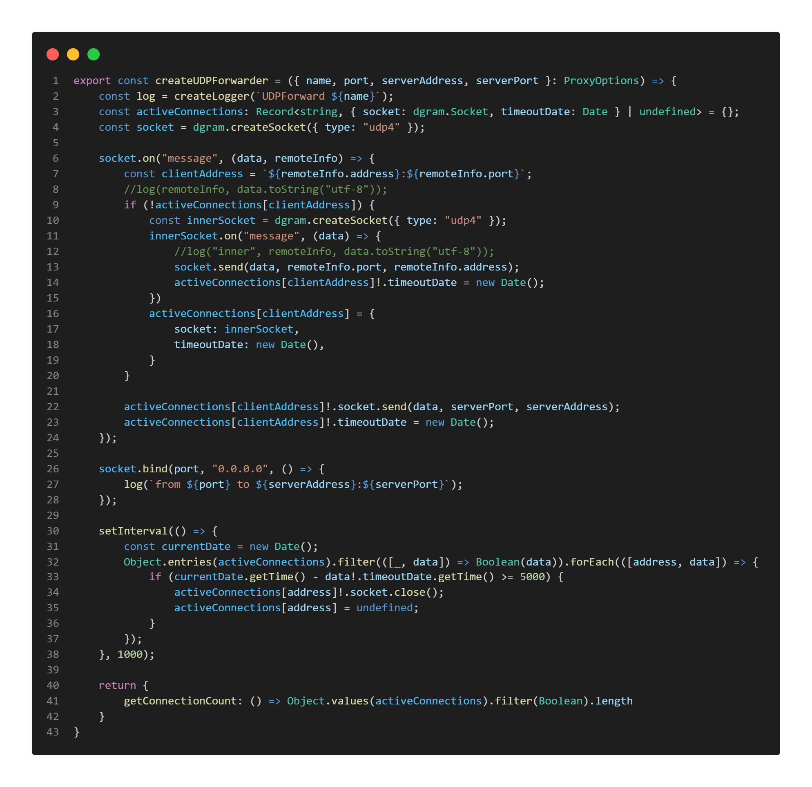

\newpage
# Anhang {-}

\hypertarget{usb}{
}
\captionof{table}{Digitaler Datenträger der Bachelorthesis inklusive Source-Code des Prototypen}

\newpage
\hypertarget{udp-forwarder}{
}
\captionof{table}{Code UDP Forwarder}

\

\newpage
\hypertarget{tcp-forwarder}{
}
\captionof{table}{Code TCP Forwarder}

\

\newpage
\hypertarget{class-diagram-1}{
}
\captionof{table}{Klassen Diagramm 1}

{ height=2500px }\

\hypertarget{class-diagram-2}{
}
\captionof{table}{Klassen Diagramm 2}

{ height=2400px }\

\hypertarget{sequence-diagram-1}{
}
\captionof{table}{Sequenz Diagramm 1}

\

\newpage
\hypertarget{sequence-diagram-2}{
}
\captionof{table}{Sequenz Diagramm 2}

\

\newpage

\hypertarget{grafana-both}{
}
\captionof{table}{Grafana Dashboard Beide Wochen}

\

\newpage

\hypertarget{grafana-first}{
}
\captionof{table}{Grafana Dashboard Erste Woche}

\

\newpage

\hypertarget{grafana-second}{
}
\captionof{table}{Grafana Dashboard Zweite Woche}

\

\newpage

\hypertarget{online-with-without-flux}{
}
\captionof{table}{Flux Source code für den Graphen "Servers online and acitve"}

\

\newpage

\hypertarget{server-status-flux}{
}
\captionof{table}{Flux Source code für die Server Status Graphen}

\