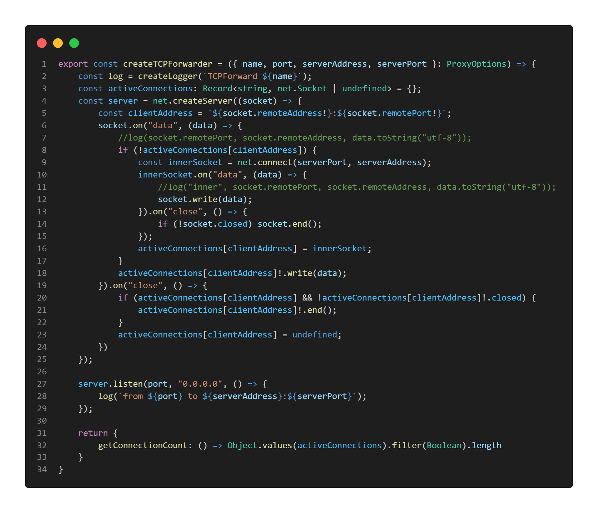

\newpage
# Anhang {-}

\hypertarget{udp-forwarder}{
}
\captionof{table}{Code UDP Forwarder}

\

\newpage
\hypertarget{tcp-forwarder}{
}
\captionof{table}{Code TCP Forwarder}

\

\newpage
\hypertarget{class-diagram}{
}
\captionof{table}{Klassen Diagramm}

\

\newpage
\hypertarget{sequence-diagram}{
}
\captionof{table}{Sequenz Diagramm}

\